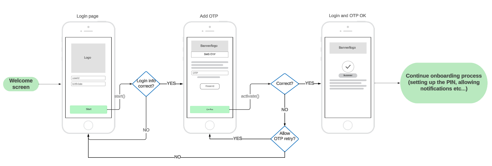

# Device Activation

With `WDOActivationService` you can onboard PowerAuth with just a piece of user information like his email, phone number, or login name.

PowerAuth enrolled in such a way will need [further user verification](Verifying-User.md) until fully operational (able to sign operations).

## Example app flow

<p align="center"></p>

## Creating an instance

To create an instance you will need a `PowerAuth` instance that is __ready to be activated__.

<!-- begin box info -->
[Documentation for `PowerAuth Mobile JS SDK`](https://developers.wultra.com/components/react-native-powerauth-mobile-sdk/). 
<!-- end -->


Example with `PowerAuth` instance:

```typescript
const powerAuth = new PowerAuth("my-pa-instance")
powerAuth.configure({
    configuration: "ARCB+...jg==", // base64 PowerAuth configuration
    baseEndpointUrl: "https://my-server-deployment.com/enrollment-server/"
})
const activationService = new WDOActivationService(
    powerAuth,
    "https://my-server-deployment.com/enrollment-server-onboarding/"
)
```

## Retrieving the status

To figure out if the activation process was already started and what is the status, you can use `hasActiveProcess`.

```typescript
/**
 * If the activation process is in progress.
 *
 * Note that even if this property is `true` it can be already discontinued on the server.
 * Calling `status()` for example after the app is launched in this case is recommended.
 */
get hasActiveProcess(): boolean;
```

If the process was started, you can verify its status by calling the `status` function. You can show an appropriate UI to the user based on this status.

```typescript
/**
 * Retrieves status of the onboarding activation.
 *
 * @return Promise resolved with onboarding status.
 */
status(): Promise<WDOOnboardingStatus>;
```

`WDOOnboardingStatus` possible values.

```typescript
declare enum WDOOnboardingStatus {
    /** Activation part of the process is in progress */
    activationInProgress = "ACTIVATION_IN_PROGRESS",
    /** Verification part of the process is in progress */
    verificationInProgress = "VERIFICATION_IN_PROGRESS",
    /** Onboarding process has failed */
    failed = "FAILED",
    /** Onboarding process is completed */
    finished = "FINISHED"
}
```

## Starting the process

To start the activation process, you can use any credentials that are sufficient to you that can identify the user.

Often, such data are user email, phone number, or userID. The definition of such data is up to your server implementation and requirements.

To start the activation, use the `start` function.

```typescript
/**
     * Start onboarding activation with user credentials.
     *
     * For example, when you require email, your object would look like this:
     * ```
     * {
     *   email: "<user_email>"
     * }
     * ```
     * @param credentials Object with credentials. Which credentials are needed should be provided by a system/backend provider.
     * @param processType The process type identification. If not specified, the default process type will be used.
     */
    start(credentials: any, processType?: string): Promise<void>;
```

### Example

```typescript

class MyUserService {
    // prepared service
    private activationService: WDOActivationService
    
    async startActivation(id: string) {
        const data = { userId: id}
        try {
            await this.activationService.start(data)
            // success, continue with `activate()`
            // at this moment, the `hasActiveProcess` starts return true
        } catch (error) {
            // show error to the user
        }
    }
}
```

## Creating the activation

To activate the user (activating the `PowerAuth` instance), data retrieved from the process start can be used with optional `OTP`. The OTP is usually sent via SMS, email, or other channel. To decide if the OTP is needed, you can use the [Configuration API](Process-Configuration.md) or have it hardcoded.

Use the `activate` function to create the activation.

```typescript
/**
 * Activate the PowerAuth instance that was passed in the initializer.
 *
 * @param activationName Name of the activation. Device name by default (usually something like John's iPhone or similar).
 * @param otp OTP code received by the user (via SMS or email). Optional when not required.
 * @return Promise resolved with activation result.
 */
activate(activationName: string, otp?: string): Promise<WDOPowerAuthActivationResult>;
```

Example implementation:

```typescript
class MyUserService {
    // prepared service
    private activationService: WDOActivationService
    
    async activate(smsOTP?: string) {
        try {
            const activationResult = await activationService.activate("my-test-activation", smsOTP)
            // PowerAuthSDK instance was activated.
            // At this moment, navigate the user to
            // the PIN keyboard to finish the PowerAuthSDK initialization.
            // For more information, follow the PowerAuthSDK documentation.
        } catch (error) {
            if (allowOnboardingOtpRetry(error)) {
                    // User entered the wrong OTP, prompt for a new one.
                    // Remaining OTP attempts count: onboardingOtpRemainingAttempts(error)
                } else {
                    // show error UI
                }
        }
    }
}
```

## Canceling the process

To cancel the process, just call the `cancel` function.

```typescript
/**
 * Cancel the activation process (issues a cancel request to the backend and clears the local process ID).
 *
 * @param forceCancel When true, the process will be canceled in the SDK even when fails on backend. `true` by default.
 */
cancel(forceCancel?: boolean): Promise<void>;
```

## OTP resend

In some cases, you need to resent the OTP:  
 - OTP was not received by the user (for example when the email ends in the spam folder).  
 - OTP expired. 

 For such cases, use `resendOTP` function.
 
 ```typescript
/**
* OTP resend request.
*
* This is intended to be displayed for the user to use in case of the OTP is not received.
* For example, when the user does not receive SMS after some time, there should be a button to "send again".
*/
resendOTP(): Promise<void>;
 ```

## Read next
- [Verifying User With Document Scan And Genuine Presence Check](Verifying-User.md)